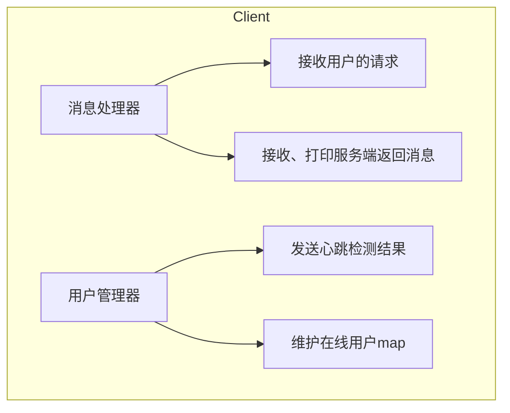
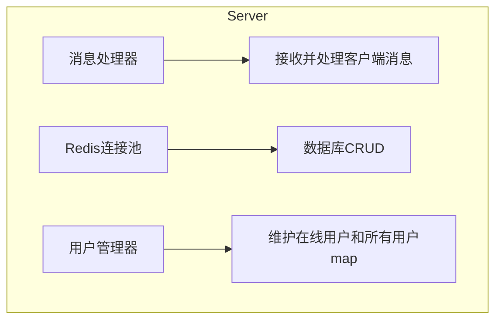
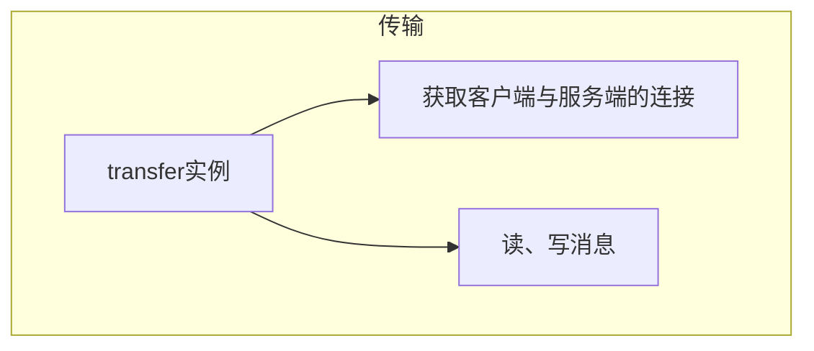
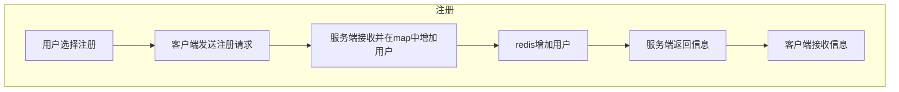
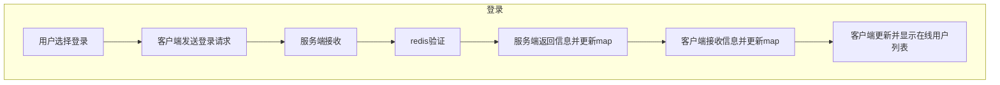

# 分布式聊天系统

## 项目简介

一个基于Go语言开发的分布式实时聊天系统，支持私聊、群聊、离线消息、用户状态管理等功能。

## :star2: 核心功能

### :dart: 基础功能

:white_check_mark:用户注册与登录

:white_check_mark:实时私聊与群聊（广播）

:white_check_mark:在线用户列表展示

:white_check_mark:用户上下线状态通知

### :rocket:高级功能

:white_check_mark:离线消息存储与推送

:white_check_mark:心跳检测与异常断开处理

:white_check_mark:跨网络远程通信

## :hammer_and_wrench:技术栈

### 后端技术

| 技术         | 用途         |
| ------------ | ------------ |
| TCP/IP       | 网络通讯协议 |
| JSON         | 消息序列化   |
| Redis        | 连接池/缓存  |
| sync.Map     | 并发消息存储 |
| sync.RWMutex | 读写锁       |

### 架构特性

:white_check_mark:C/S架构：客户端-服务器模式

:white_check_mark:并发处理：Goroutine处理多连接

:white_check_mark:状态同步：实时用户状态管理

:white_check_mark:连接池优化：Redis连接复用

:white_check_mark:锁机制：保证数据一致性

## :building_construction:系统架构

### :desktop_computer:组件图

### 消息流程

广播、私聊、下线功能同理。

## :bulb:优化

:one:系统分配ID，而不是用户自己选择ID

## :handshake:参与贡献

欢迎提交Issue和Pull Request !